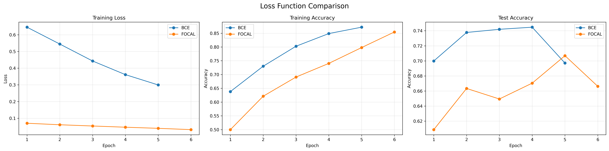
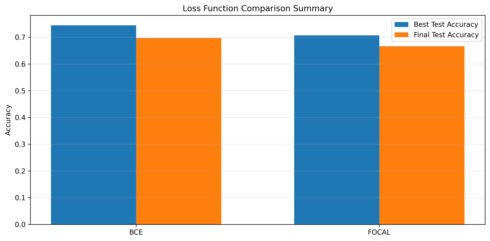
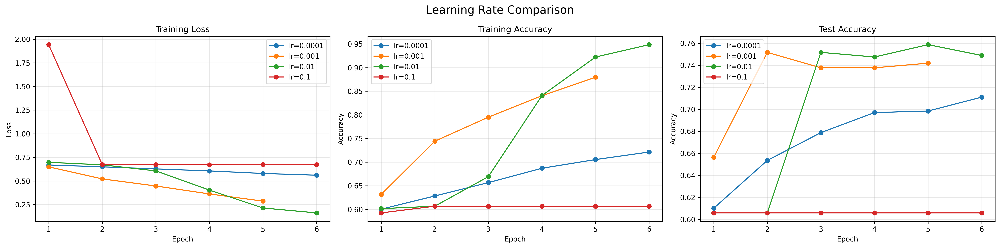
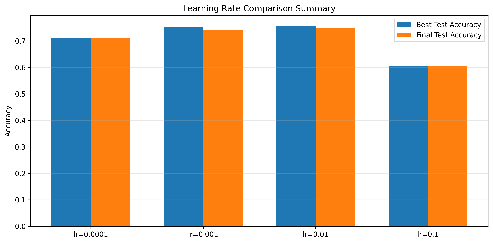
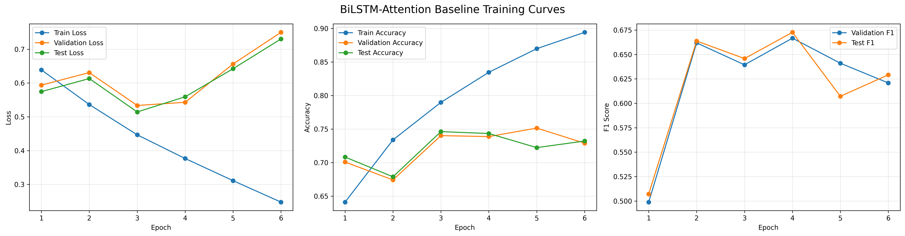
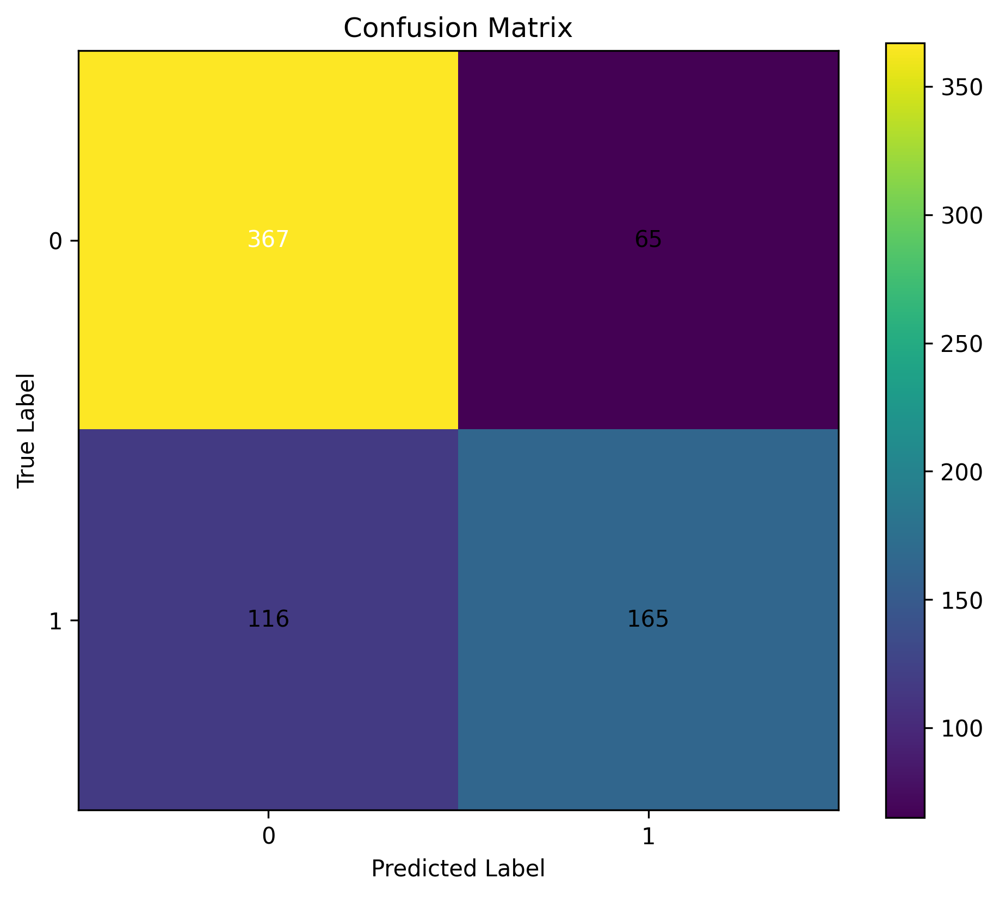
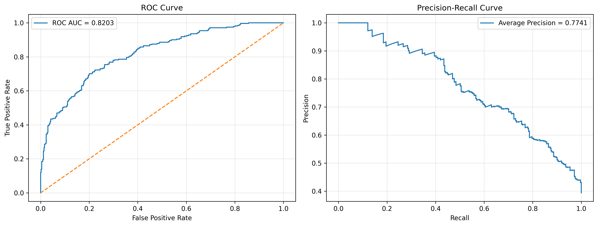

# Fake News Detection with Deep Learning

A comprehensive deep learning project for detecting fake news using BiLSTM-Attention and TextCNN architectures.

## Overview

This project implements and compares two neural network architectures for binary classification of news articles as either real or fake:

- **BiLSTM-Attention**: Bidirectional LSTM with attention mechanism for capturing sequential dependencies and long-range patterns
- **TextCNN**: Convolutional Neural Network with multi-kernel filters for detecting local n-gram patterns

The project includes comprehensive hyperparameter ablation studies, evaluation metrics, and visualization tools.

## Features

- Modular project structure with separated concerns
- Two state-of-the-art model architectures
- Comprehensive hyperparameter tuning (loss functions, learning rates, batch sizes)
- Rich visualizations (training curves, confusion matrices, ROC/PR curves)
- Multiple evaluation metrics (accuracy, precision, recall, F1, ROC AUC, PR AUC)
- Early stopping mechanism to prevent overfitting
- Detailed prediction analysis and model interpretability

## Installation

### Prerequisites

- Python 3.8 or higher
- pip

### Setup

1. Clone the repository:
```bash
git clone https://github.com/Xuxu0310/fakenews.git
cd fakenews
```

2. Install dependencies:
```bash
pip install -r requirements.txt
```

### Requirements

- torch>=2.0.0
- pandas>=1.5.0
- numpy>=1.24.0
- scikit-learn>=1.3.0
- matplotlib>=3.7.0
- seaborn>=0.12.0

## Usage

### Running the Main Experiment

```bash
python main.py
```

This will:
1. Load and preprocess the dataset
2. Perform exploratory data analysis
3. Train baseline BiLSTM-Attention model
4. Conduct loss function comparison (BCE vs Focal Loss)
5. Perform learning rate ablation study
6. Perform batch size ablation study
7. Compare BiLSTM-Attention and TextCNN architectures
8. Generate all visualizations and save results

### Dataset Format

The project expects a CSV file with the following format:

| text | label |
|------|-------|
| Article content... | 0/1 |

Where `label = 1` indicates fake news and `label = 0` indicates real news.

### Configuration

Hyperparameters can be modified in `src/config.py`:

```python
@dataclass
class Config:
    # Data
    csv_path: str = "fakenews.csv"
    test_size: float = 0.15
    val_size: float = 0.15
    max_vocab_size: int = 30000
    max_seq_len: int = 220

    # Model
    embed_dim: int = 200
    hidden_dim: int = 128
    num_layers: int = 2
    dropout: float = 0.35

    # Training
    epochs: int = 6
    lr: float = 0.001
    batch_size: int = 32

    # System
    seed: int = 42
    device: str = "cuda" if torch.cuda.is_available() else "cpu"
```

## Project Structure

```
fakenews/
├── src/
│   ├── config.py           # Configuration and hyperparameters
│   ├── data_processing.py  # Data loading, cleaning, and preprocessing
│   ├── dataset.py          # PyTorch Dataset and DataLoader
│   ├── models.py           # BiLSTM-Attention and TextCNN model definitions
│   ├── loss.py             # BCE and Focal Loss implementations
│   ├── train.py            # Training and evaluation functions
│   ├── utils.py            # Utility functions
│   └── visualize.py        # Visualization and plotting utilities
├── outputs/                # Generated outputs and visualizations
│   ├── *.png               # Training curves, confusion matrices, ROC/PR curves
│   ├── *.csv               # Training histories and predictions
│   └── *.pt                # Saved model checkpoints
├── main.py                 # Main execution script
├── requirements.txt        # Python dependencies
├── README.md              # This file
└── fakenews.csv           # Dataset (not included in repo)
```

## Model Architectures

### BiLSTM-Attention

- **Embedding Layer**: 200-dimensional word embeddings
- **BiLSTM Layers**: 2 bidirectional layers with 128 hidden units
- **Attention Mechanism**: Computes importance weights for each token position
- **Classifier**: Fully connected layers with dropout regularization

#### Hyperparameter Analysis

**Loss Function Comparison**





The BiLSTM-Attention model was evaluated with two loss functions: Binary Cross-Entropy (BCE) and Focal Loss. BCE Loss achieved better performance (~75% test accuracy) compared to Focal Loss (~67% test accuracy), indicating that the class imbalance in the dataset is mild and does not require specialized loss functions.

**Learning Rate Ablation**





Four learning rates were tested: 0.0001, 0.001, 0.01, and 0.1. The learning rate of 0.001 achieved optimal performance (~75% test accuracy) with stable convergence. Lower rates (0.0001) resulted in underfitting, while higher rates (0.01, 0.1) led to overfitting and instability.

**Training Curves**



The baseline BiLSTM-Attention model shows smooth convergence over 6 epochs, with training loss decreasing steadily and validation accuracy improving before plateauing. Early stopping prevents overfitting by restoring the best model state based on validation performance.

**Model Evaluation**





### TextCNN

- **Embedding Layer**: 200-dimensional word embeddings
- **Convolutional Filters**: 128 filters with kernel sizes (3, 4, 5)
- **Max Pooling**: Extracts most salient features from each filter
- **Classifier**: Fully connected layers with dropout regularization

## Experimental Results

### Optimal Hyperparameters

| Parameter | BiLSTM-Attention | TextCNN |
|-----------|------------------|---------|
| Loss Function | BCE Loss | BCE Loss |
| Learning Rate | 0.001 | 0.001 |
| Batch Size | 32 | 32 |
| Dropout | 0.35 | 0.35 |

### Performance Comparison

| Model | Test Accuracy | Test F1 | Training Time/Epoch |
|-------|---------------|---------|---------------------|
| BiLSTM-Attention | ~74.1% | ~62.1% | ~7.8s |
| TextCNN | ~74.5% | ~63.5% | ~1.2s |

**Conclusion**: TextCNN achieves comparable or slightly better performance with significantly faster training speed (~6.5x faster).

### Key Findings

1. **Loss Function**: BCE Loss outperforms Focal Loss on this dataset, indicating that the class imbalance is mild
2. **Learning Rate**: 0.001 provides optimal balance between convergence speed and stability
3. **Batch Size**: 32 achieves the best performance with stable training
4. **Architecture**: TextCNN is recommended for this task due to its efficiency and comparable accuracy

## Evaluation Metrics

The project evaluates models using multiple metrics:

- **Accuracy**: Overall classification accuracy
- **Precision**: Reliability of positive predictions
- **Recall**: Coverage of actual positive cases
- **F1 Score**: Harmonic mean of precision and recall
- **ROC AUC**: Area under the ROC curve
- **PR AUC**: Area under the Precision-Recall curve

## Visualization Examples

The project generates the following visualizations:

- Class distribution bar chart
- Text length distribution histogram
- Training curves (loss and accuracy)
- Confusion matrix
- ROC and Precision-Recall curves
- Hyperparameter comparison plots
- Architecture comparison plots

## Contributing

Contributions are welcome! Please feel free to submit a Pull Request.

## License

This project is licensed under the MIT License.

## Acknowledgments

- PyTorch team for the deep learning framework
- Scikit-learn for evaluation metrics and utilities
- The open-source community for various NLP tools and resources

## Contact

For questions or suggestions, please open an issue on GitHub.
